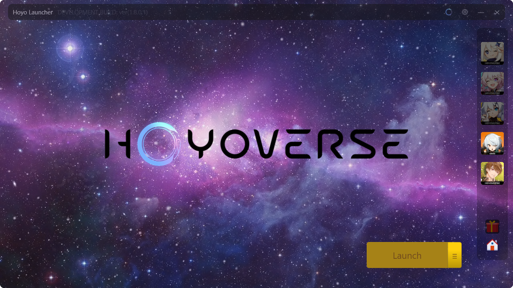
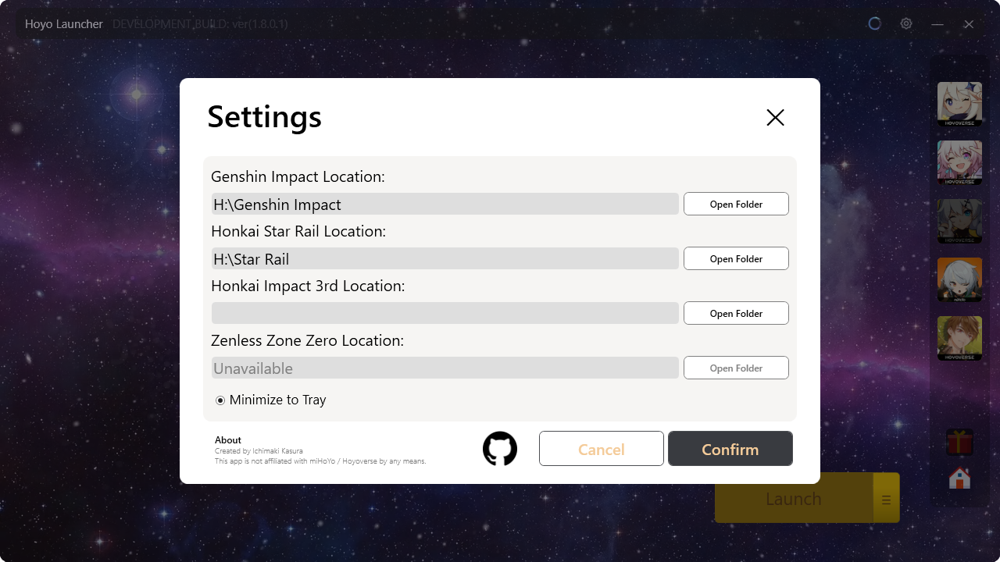
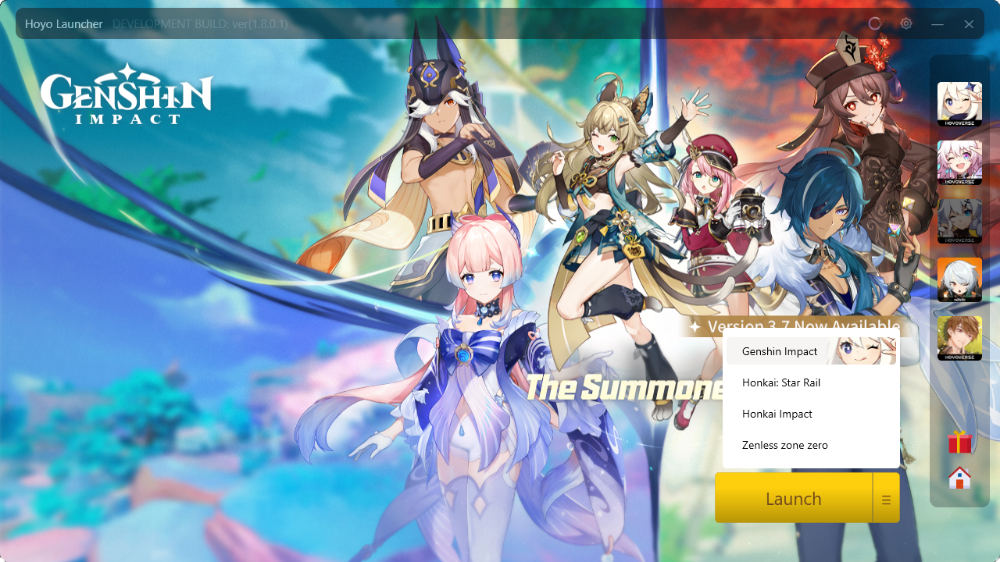
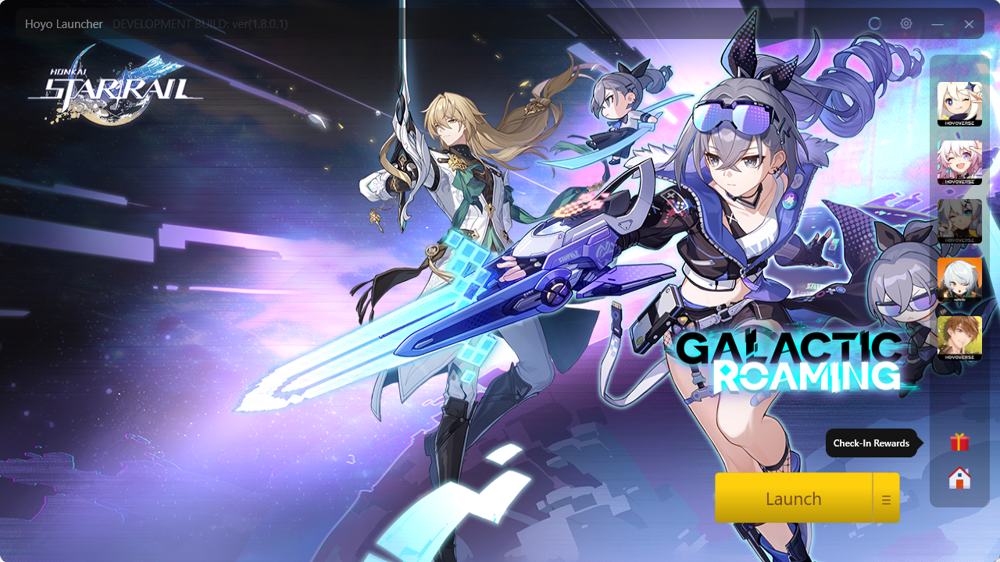
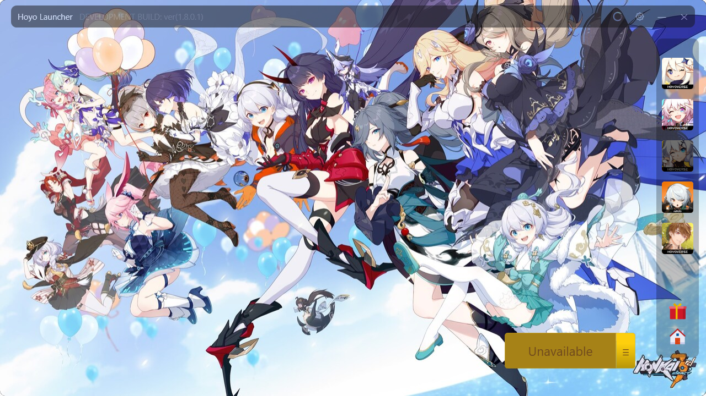
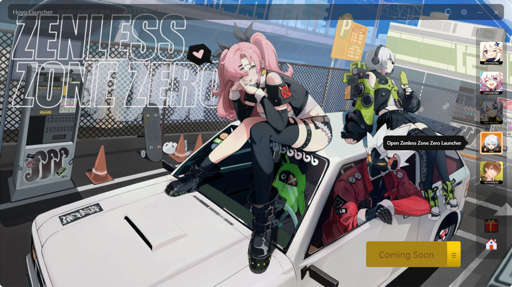

# Simple Hoyoverse Launcher
A very simple Hoyoverse launcher for Hoyoverse games on PC. 
the app is built based on my own preference.

## Features
- very Lightweight program (only uses less than 8mb | but needs an NET 7 runtime env)
- Ready to run no installation needed (unless you haven't installed the NET 7 runtime env)
- Open source
- Removed bloat links (such as socials)
- Shortcut button for Check-Ins.
- Modernized UI but still retain some few original design.

If you want a more complex launcher you can try [Collapse Launcher](https://github.com/neon-nyan/Collapse)

# Overview
| | |
|-|-|
|||
|||
|||
---

Requirements: NET 7 

## Notes:
Games cannot be updated using this launcher. 
but you can just click the side button to open the game original launcher 
 - ~~Need to be whitelisted on antivirus if you want it to actually work *smoothly* read the comment on App.xaml.cs Line 41~~
## DISCLAIMER:
This app is not affiliated with miHoYo / Hoyoverse by any means.