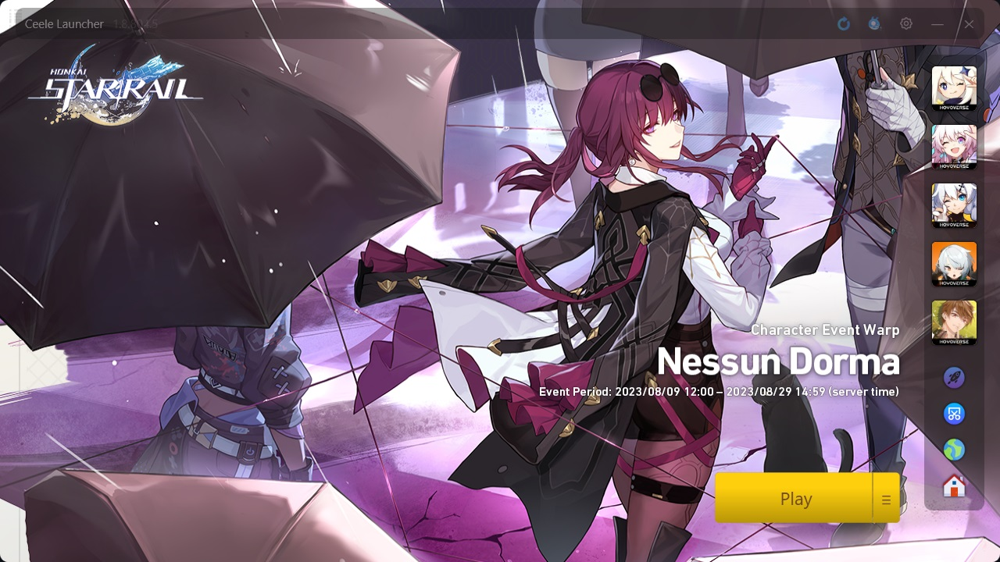
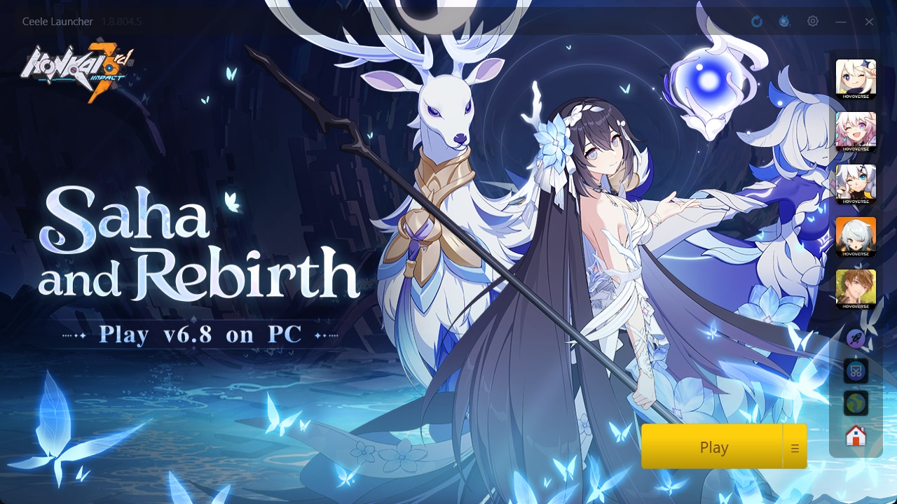
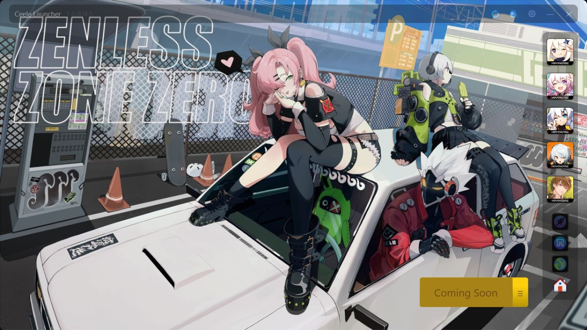
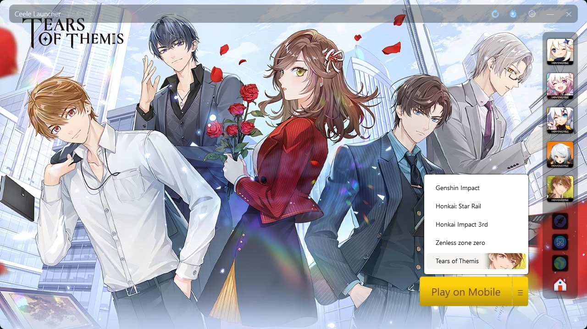
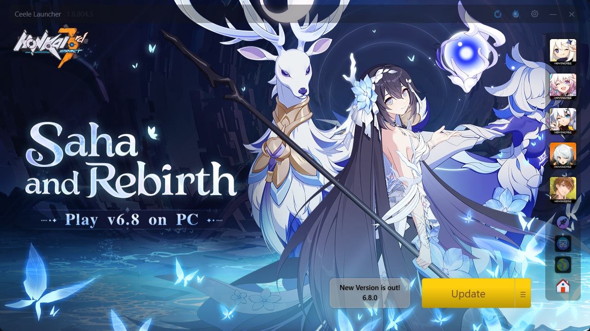
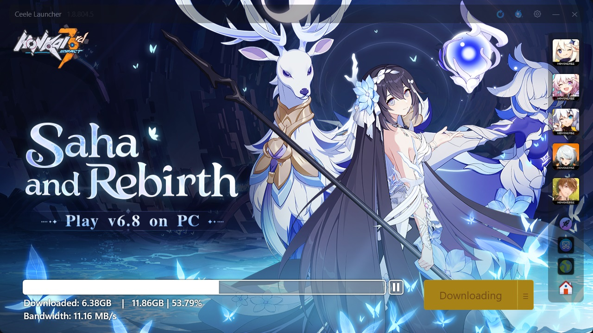
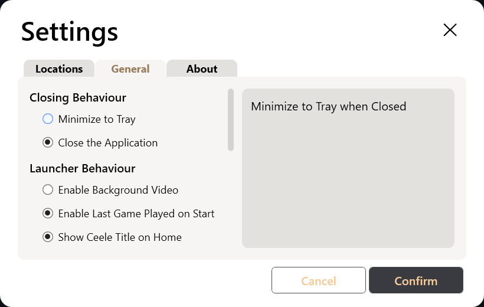

 
A very simple Game launcher for Mihoyo/Hoyoverse games on PC. 
the app is built based on my own preference.

 

## [NOTICE TO USERS]
[HoyoPlay](https://hoyoplay.hoyoverse.com/) is now available as it is the official Hoyo's All-In-One game launcher for their games.  
Though the new HoyoPlay has some problems.  
1. The launcher size of it is almost 300+ MB
2. The side buttons doesn't include a link to direct to check-in rewards (though It might be added in the future.)
3. *unable to change launcher size? (I may only have 1 monitor so I cannot confirm if the launcher window resizes if the user have 4k monitor)
 

This could be the last time I'm updating and maintaining this project. Still, feel free to maintain or fork it.

## Features
- Very Lightweight program (only uses less than 5mb | but needs an NET 7 runtime env)
- Ready to run no installation needed (unless you haven't installed the NET 7 runtime env)
- Open source
- Removed bloat links (such as socials)
- Shortcut buttons for Check-Ins | Map | Homepage | Screenshots.
- Modernized UI but still retain some few original design (barely).
- Knows when the game is outdated.

## Notes:
The App requires [NET-7](https://download.visualstudio.microsoft.com/download/pr/4b99bbc8-917a-417c-907b-d408341726a5/78b225344fbb9b80d3da3681e1d20d68/dotnet-runtime-7.0.5-win-x64.exe)

# Main Overview
| |
|-|
||

_this picture was taken using previewbuild version 1.8.804.5_

# Games Overview
| | |
|-|-|
|||
|||
|||
|||

_these picture was taken using version 1.8.804.5_

# Settings Overview
 | | | |
|-|-|-|
||||

# Download Links
  

 

## DISCLAIMER:
This app is not affiliated with miHoYo / Hoyoverse by any means.

